# A Numerical Study of the One-Dimensional Finite Square Well Potential

### Bound-state energies using a hybrid of the bisection and quadratic approximation methods

**Emmanuel Osei Boakye** — B.Sc. Physics project, Department of Physics, University of Ghana (2024)
Supervisor: **Dr. George Nkrumah-Buandoh**

*Revised edition of the thesis: restructured code, a single program for every well, plots of even and odd states together, and tests of the extreme cases.*

---

## Abstract

This study determines the energy eigenvalues of the quantum-mechanical finite square well by solving the transcendental equations that follow from the Schrödinger equation. Textbooks [1, 2] solve these equations graphically, which explains the qualitative behaviour but whose accuracy is limited by the scale of the graph. Here the roots are found numerically with a **hybrid of the bisection and quadratic approximation methods** [3], which keeps the guaranteed convergence of bisection and the speed of quadratic approximation. The hybrid reaches machine precision in 2–6 iterations, where bisection needs 26–39.

The energies are used to build the normalised wavefunctions of every bound state, and the effect of the well depth $V_0$ and half-width $a$ on the number of bound states is examined. As the well becomes shallower or narrower, bound states disappear one at a time from the top, but **one even ground state always remains**. The extreme cases are checked quantitatively:

- a very **deep** well reproduces the infinite square well;
- a very **shallow** or very **narrow** well reproduces the **delta-function well**, in both energy and wavefunction.

In every one of the 322 wells in the parameter sweeps, the number of states found agrees with the exact count $\lfloor 2z_0/\pi\rfloor + 1$.

---

## Contents

1. [Quick start](#1-quick-start)
2. [Project structure](#2-project-structure)
3. [Theory](#3-theory)
4. [Numerical method](#4-numerical-method)
5. [Results](#5-results)
6. [Extreme cases](#6-extreme-cases)
7. [Conclusions](#7-conclusions)
8. [Corrections to the original thesis and code](#8-corrections-to-the-original-thesis-and-code)
9. [References](#9-references)

---

## 1. Quick start

You need `gfortran` and `gnuplot`. On Ubuntu:

```bash
sudo apt install gfortran gnuplot
./run_all.sh
```

`run_all.sh` compiles everything, runs the root-finding tests, solves every well in this README, writes the numbers to `data/` and draws every figure into `figures/`. It takes about ten seconds.

Each program can also be run on its own for any well. Input is `V0 a` (eV, Å):

```bash
echo "10 3" | bin/energies          # all bound-state energies
echo "10 3" | bin/wavefunctions     # x, V(x), psi_1, psi_2, ...
echo "10 3" | bin/transcendental    # E, f_even(E), f_odd(E)
echo "10 3 even 6.0 6.4" | bin/convergence   # hybrid vs bisection on one bracket
```

---

## 2. Project structure

The work follows the order of the thesis: **each method is first tested on a simple equation**, then applied to the finite well.

```
root_finding_tests/            Step 1: each method tested on a simple equation
    bisection.f90                  f(x) = x^2 - 1               -> root 1
    quadratic_approximation.f90    f(x) = 2x - 6                -> root 3
    hybrid.f90                     f(x) = 5x^2 + 12x + 7        -> root -1.4

finite_well/                   Step 2: the finite square well
    roots.f90                      bisection and hybrid root finders (module)
    well.f90                       alpha, beta, f_even, f_odd, normalised psi, find_states (module)
    transcendental.f90             tabulates f_even(E), f_odd(E)
    energies.f90                   finds ALL bound states, even and odd
    wavefunctions.f90              all wavefunctions on one grid
    convergence.f90                hybrid vs bisection, iteration by iteration

plots/                         gnuplot scripts (style.gp holds the shared look)
figures/                       the figures below
original_thesis_code/          the programs printed in Appendix A of the thesis, unchanged
run_all.sh                     builds and runs everything
```

Compared with the original code:

- The thesis had separate copies of the physics for even states, odd states, $V_0 = 10$ eV and $a = 3$ Å. `alpha`, `beta`, `f_even` and `f_odd` are now written **once**, in `well.f90`. `V0` and `a` are read in, so every well uses the same program.
- The hybrid method is written **once**, in `roots.f90`. `energies.f90` scans $0 < E < V_0$ for sign changes, so it finds the brackets itself; they no longer have to be read off a graph and typed in.

---

## 3. Theory

### 3.1 The Schrödinger equation

A particle of mass $m$ in a potential $V(x)$ has stationary states $\Psi_n(x,t) = \psi_n(x)\,e^{-iE_nt/\hbar}$, where $\psi_n$ solves the time-independent Schrödinger equation

$$
-\frac{\hbar^2}{2m}\frac{d^2\psi}{dx^2} + V(x)\,\psi = E\,\psi .
$$

### 3.2 The finite square well

$$
V(x) = \begin{cases} 0, & -a \le x \le a \quad\text{(inside, region II)}\\ V_0, & |x| > a \quad\text{(outside, regions I and III)}\end{cases}
$$

For a bound state, $0 < E < V_0$. Define

$$
\alpha = \frac{\sqrt{2mE}}{\hbar}, \qquad \beta = \frac{\sqrt{2m(V_0 - E)}}{\hbar}.
$$

Inside the well $\psi'' = -\alpha^2\psi$, which gives oscillating solutions. Outside it $\psi'' = \beta^2\psi$, which gives exponentials, and only the decaying exponential is allowed. The well is symmetric, $V(x) = V(-x)$, so every state is either **even** or **odd**:

$$
\psi_{\text{even}}(x) = \begin{cases} C e^{\beta x}, & x < -a\\ B\cos\alpha x, & |x| \le a\\ C e^{-\beta x}, & x > a\end{cases}
\qquad
\psi_{\text{odd}}(x) = \begin{cases} -C e^{\beta x}, & x < -a\\ B\sin\alpha x, & |x| \le a\\ C e^{-\beta x}, & x > a\end{cases}
$$

### 3.3 The transcendental equations

$\psi$ and $d\psi/dx$ must be continuous at $x = a$. Dividing the two matching conditions gives

$$
\text{even:}\quad \beta = \alpha\tan\alpha a, \qquad\qquad \text{odd:}\quad -\beta = \alpha\cot\alpha a .
$$

Both sides depend on $E$ through $\alpha$ and $\beta$, so the allowed energies are the roots of these equations. $\tan$ and $\cot$ blow up, which is bad for a root finder, so we multiply through by $\cos\alpha a$ and $\sin\alpha a$ and solve instead

$$
\boxed{f_{\text{even}}(E) = \alpha\sin\alpha a - \beta\cos\alpha a = 0}
\qquad
\boxed{f_{\text{odd}}(E) = \alpha\cos\alpha a + \beta\sin\alpha a = 0}
$$

These are smooth, continuous functions of $E$ with no poles, which makes them ideal for bisection. They introduce no false roots in $0 < E < V_0$. (The point $E = 0$ is a trivial zero of $f_{\text{odd}}$ with $\alpha = 0$. The scan starts at $E > 0$ and requires a strict sign change, so it is never picked up.)

**Textbook (graphical) form.** With $z = \alpha a$ and $z_0 = a\sqrt{2mV_0}/\hbar$, the even equation becomes $\tan z = \sqrt{(z_0/z)^2 - 1}$ (Griffiths [2]), and the odd one $-\cot z = \sqrt{(z_0/z)^2 - 1}$. A new branch of $\tan$ or $-\cot$ starts at every multiple of $\pi/2$, so the **number of bound states** is

$$
N = \left\lfloor \frac{2z_0}{\pi} \right\rfloor + 1 .
$$

$N \ge 1$ always: a 1D symmetric well, however weak, always holds an even ground state. `energies` prints this prediction next to the count it actually finds.

### 3.4 Normalised wavefunctions

Choosing the constants so that $\psi$ is continuous, and normalising $\int|\psi|^2dx = 1$, gives

$$
\psi_{\text{even}}(x) = \frac{1}{N_e}\begin{cases}\cos\alpha x, & |x|\le a\\ \cos\alpha a\; e^{-\beta(|x|-a)}, & |x|>a\end{cases}
\qquad
N_e^2 = a + \frac{\sin 2\alpha a}{2\alpha} + \frac{\cos^2\alpha a}{\beta},
$$

$$
\psi_{\text{odd}}(x) = \frac{1}{N_o}\begin{cases}\sin\alpha x, & |x|\le a\\ \operatorname{sgn}(x)\,\sin\alpha a\; e^{-\beta(|x|-a)}, & |x|>a\end{cases}
\qquad
N_o^2 = a - \frac{\sin 2\alpha a}{2\alpha} + \frac{\sin^2\alpha a}{\beta}.
$$

The last term of $N^2$ is the part of the particle *outside* the well. The probability of finding the particle in the classically forbidden region (tunnelling) is therefore

$$
P_{\text{out}} = \frac{\cos^2\alpha a/\beta}{N_e^2}\ \text{(even)}, \qquad P_{\text{out}} = \frac{\sin^2\alpha a/\beta}{N_o^2}\ \text{(odd)} .
$$

### 3.5 Units

Energies are in eV, lengths in Å and masses in electron masses $m_e$, with

$$
\frac{\hbar^2}{m_e} = 7.6199682\ \text{eV·Å}^2 ,
$$

so $\alpha = \sqrt{2E/7.6199682}$ Å⁻¹ for an electron ($m = 1$).

---

## 4. Numerical method

The root of $f(x)$ is the value of $x$ where $f(x) = 0$.

### 4.1 Bisection

If $f$ is continuous and $f(x_L)f(x_R) < 0$, a root lies in $[x_L, x_R]$. Take the midpoint

$$
x_3 = \frac{x_L + x_R}{2}.
$$

If $f(x_L)f(x_3) \le 0$ the root is in $[x_L, x_3]$, so set $x_R = x_3$; otherwise set $x_L = x_3$. Repeat until $|x_R - x_L| < $ tol. Bisection **always converges**, but slowly: the error halves at each step, so going from a 0.4 eV bracket to $10^{-12}$ eV takes about 39 steps.

### 4.2 Quadratic approximation

Fit a parabola $p(x) = a(x - x_2)^2 + b(x - x_2) + c$ through three points $x_0, x_1, x_2$ [3]:

$$
a = \frac{(x_1 - x_2)[f(x_0) - f(x_2)] - (x_0 - x_2)[f(x_1) - f(x_2)]}{(x_0 - x_1)(x_0 - x_2)(x_1 - x_2)}, \qquad
b = \frac{(x_0 - x_2)^2[f(x_1) - f(x_2)] - (x_1 - x_2)^2[f(x_0) - f(x_2)]}{(x_0 - x_1)(x_0 - x_2)(x_1 - x_2)}, \qquad
c = f(x_2).
$$

The root of $p$ closest to $x_2$ is computed in the form that avoids subtracting nearly equal numbers:

$$
x_3 = x_2 - \frac{2c}{b + \sqrt{b^2 - 4ac}} \quad (b \ge 0), \qquad
x_3 = x_2 + \frac{2c}{-b + \sqrt{b^2 - 4ac}} \quad (b < 0).
$$

Then shift $(x_0, x_1, x_2) \leftarrow (x_1, x_2, x_3)$ and repeat. This converges very fast, roughly like Newton's method, but it is **not safe**: $b^2 - 4ac$ can be negative, or $x_3$ can jump away from the root.

### 4.3 The hybrid

At every iteration, try the quadratic step first and accept it only if it is safe. Otherwise take a bisection step. The bracket $[x_L, x_R]$ is updated every iteration, so the root can never be lost.

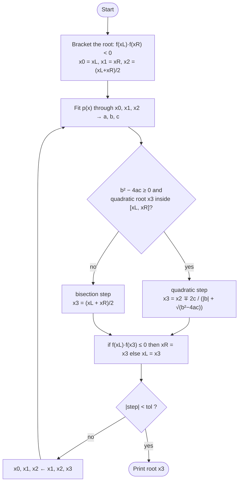
```mermaid
flowchart TD
    A([Start]) --> B["Bracket the root: f(xL)·f(xR) < 0<br/>x0 = xL, x1 = xR, x2 = (xL+xR)/2"]
    B --> C["Fit p(x) through x0, x1, x2 → a, b, c"]
    C --> D{"b² − 4ac ≥ 0 and<br/>quadratic root x3 inside [xL, xR]?"}
    D -- yes --> E["quadratic step<br/>x3 = x2 ∓ 2c / (|b| + √(b²−4ac))"]
    D -- no --> F["bisection step<br/>x3 = (xL + xR)/2"]
    E --> G["if f(xL)·f(x3) ≤ 0 then xR = x3 else xL = x3"]
    F --> G
    G --> H{"|step| < tol ?"}
    H -- no --> I["x0, x1, x2 ← x1, x2, x3"] --> C
    H -- yes --> J([Print root x3])
```

**The safety test.** $x_3$ lies inside the bracket if and only if $(x_3 - x_L)(x_3 - x_R) \le 0$. With $x_3 = x_2 - 2c/D$, where $D = b + \sqrt{b^2 - 4ac}$, multiplying by $D^2 > 0$ gives the thesis's `root_tester` in its corrected form:

$$
\big[(x_2 - x_L)D - 2c\big]\,\big[(x_2 - x_R)D - 2c\big] \le 0 .
$$

For $b < 0$, use $D = -b + \sqrt{b^2 - 4ac}$ and $+2c$ in place of $-2c$.

### 4.4 Step 1: testing on simple equations

Before touching the physics, each method is checked on an equation whose root is known (`root_finding_tests/`):

| Program | Equation | Interval / guesses | Root found | Iterations |
|---|---|---|---|---|
| `bisection.f90` | $x^2 - 1 = 0$ | $[0, 3]$ | 0.99999999999977 | 41 |
| `quadratic_approximation.f90` | $2x - 6 = 0$ | 0.5, 4, 5 | 3.0000000000000 | 2 |
| `hybrid.f90` | $5x^2 + 12x + 7 = 0$ | $[-1.2, -2.8]$ | −1.4000000000000 | 2 |

The quadratic and hybrid methods are exact in one step here because the test functions are themselves polynomials of degree ≤ 2. This confirms that the formulas for $a$, $b$, $c$ and $x_3$ are coded correctly.

### 4.5 Step 2: finding *all* the states automatically

`find_states` in `well.f90` divides $0 < E < V_0$ into 20 000 steps and records every step where $f_{\text{even}}$ or $f_{\text{odd}}$ changes sign. That is the automatic version of reading the brackets off the graph in Fig. 1. It then runs the hybrid inside each bracket with tolerance $10^{-12}V_0$. Each root is also recomputed with plain bisection, so the iteration counts can be compared.

---

## 5. Results

### 5.1 The reference well: $V_0 = 10$ eV, $a = 3$ Å

$z_0 = 4.860$, so $N = \lfloor 2(4.860)/\pi\rfloor + 1 = 4$ states are expected, and four are found.

| n | parity | $E_n$ (eV), this work | $E_n$ (eV), original thesis | $P_{\text{out}}$ |
|---|---|---|---|---|
| 1 | even | **0.715452497485611** | 0.71545251406668 | 0.013 |
| 2 | odd  | **2.821391864736787** | 2.82139160807005 | 0.055 |
| 3 | even | **6.148644135757184** | 6.14859905397473 | 0.153 |
| 4 | odd  | **9.867203745154093** | 9.86720383515641 | 0.633 |

The values agree to 7 significant figures, except for $n = 3$, which agrees to only 5. Both differences come from small bugs in the original code that are explained in [§8](#8-corrections-to-the-original-thesis-and-code). The new values are the correct ones: $f_{\text{even}}(6.148644135757) = 3\times10^{-16}$, whereas $f_{\text{even}}(6.148599054) = 3\times10^{-5}$.

Higher states leak further into the walls: the top state, only 0.13 eV below the rim, spends **63 %** of its time outside the well.

**Fig. 1 — The two transcendental functions, with the roots found by the hybrid method.** Even and odd roots alternate.

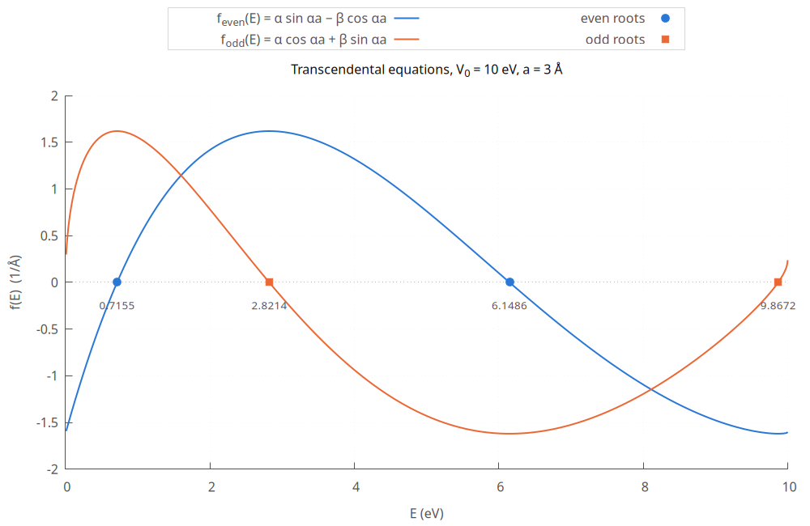

**Fig. 2 — The textbook graphical solution (thesis Fig. 2), now for even *and* odd states.** The hybrid-method roots sit exactly on the intersections.

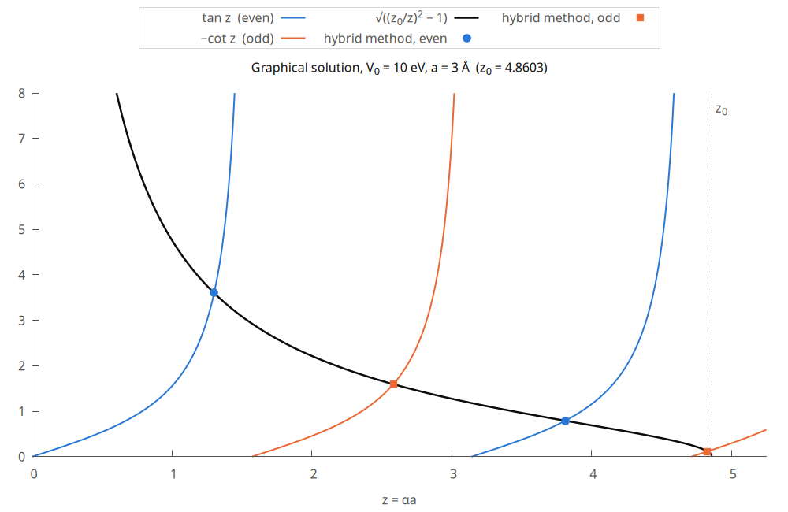

**Fig. 3 — All four bound states on one plot.** Each normalised $\psi_n$ is drawn on its own energy level inside $V(x)$; even states are blue, odd states orange. State $n$ has $n - 1$ nodes, the parity alternates even, odd, even, odd, and every state leaks into the walls.

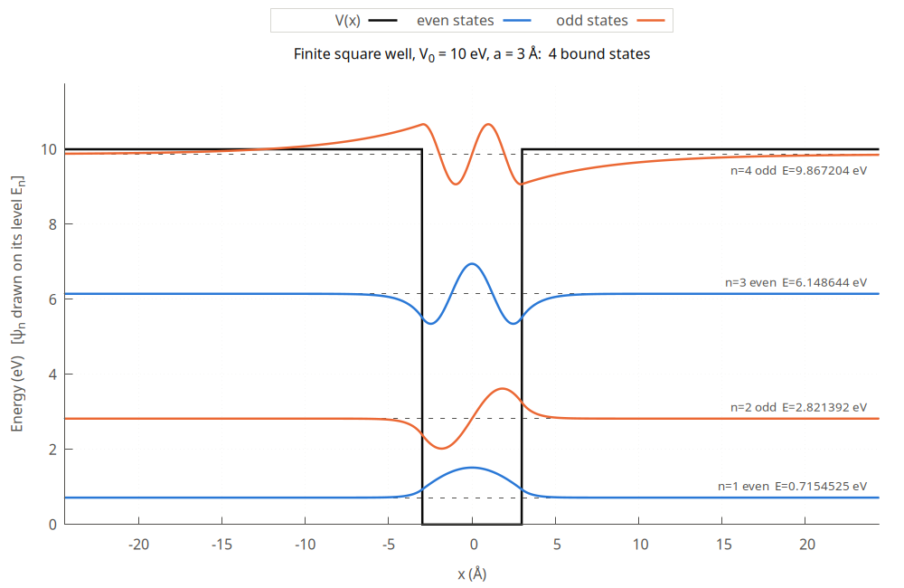

### 5.2 Hybrid vs bisection

The convergence program starts from the same brackets the thesis used, $[6.0, 6.4]$ and $[9.5, 10.0]$ eV:

| State | Bracket (eV) | Hybrid iterations | Bisection iterations |
|---|---|---|---|
| $n = 3$, even | [6.0, 6.4] | **4** | 39 |
| $n = 4$, odd  | [9.5, 10.0] | **6** | 39 |

Over the 322 distinct wells of the depth, width and deep-well sweeps (1 267 states), the hybrid needed **2.1 iterations on average (at most 6)**, against 26 for bisection on the same brackets.

| Even state, $n = 3$ | Odd state, $n = 4$ |
|---|---|
| 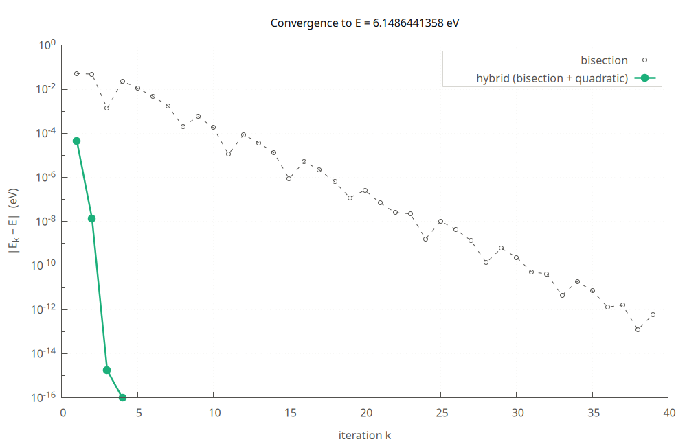 | 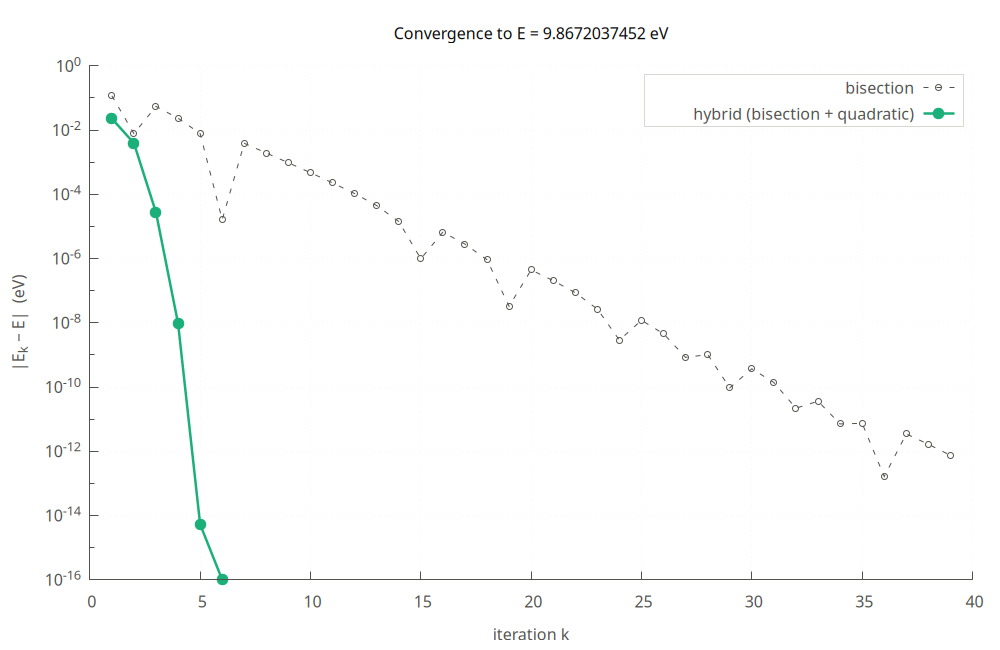 |

The hybrid error falls superlinearly ($10^{-4} \to 10^{-8} \to 10^{-16}$), the typical behaviour of quadratic approximation. Bisection only halves the error at each step.

### 5.3 Effect of the well depth $V_0$ (with $a = 3$ Å)

| $V_0$ (eV) | $z_0$ | States | Energies (eV), e = even, o = odd |
|---|---|---|---|
| 10  | 4.860 | 4 | 0.71545 e, 2.82139 o, 6.14864 e, 9.86720 o |
| 6   | 3.765 | 3 | 0.64695 e, 2.51496 o, 5.21818 e |
| 2   | 2.174 | 2 | 0.47646 e, 1.67230 o |
| 1   | 1.537 | 1 | 0.36221 e |
| 0.5 | 1.087 | 1 | 0.25479 e |

| $V_0 = 6$ eV | $V_0 = 2$ eV |
|---|---|
| 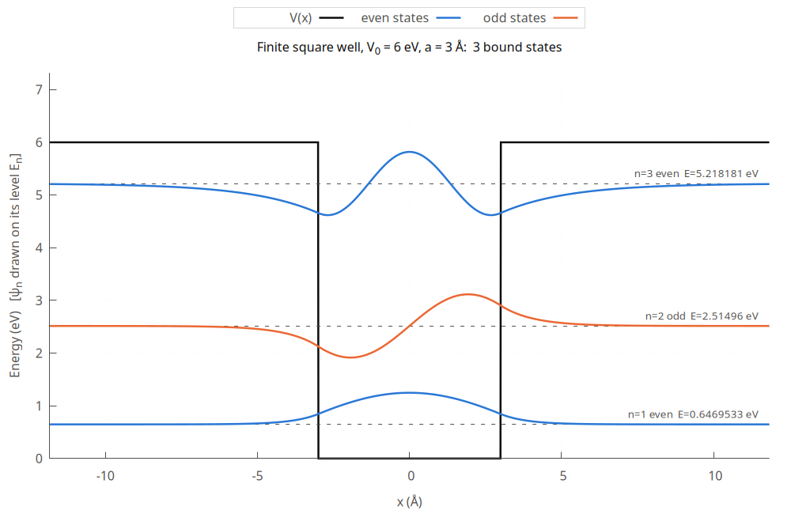 | 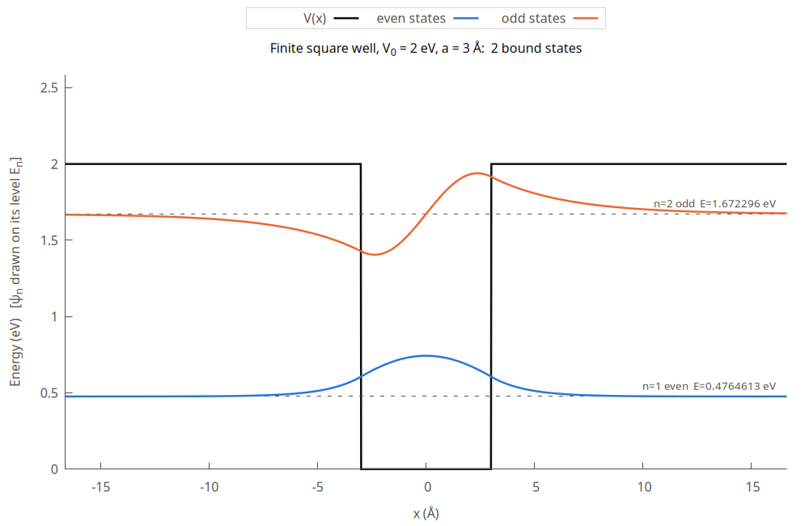 |
| $V_0 = 1$ eV | $V_0 = 0.5$ eV |
| 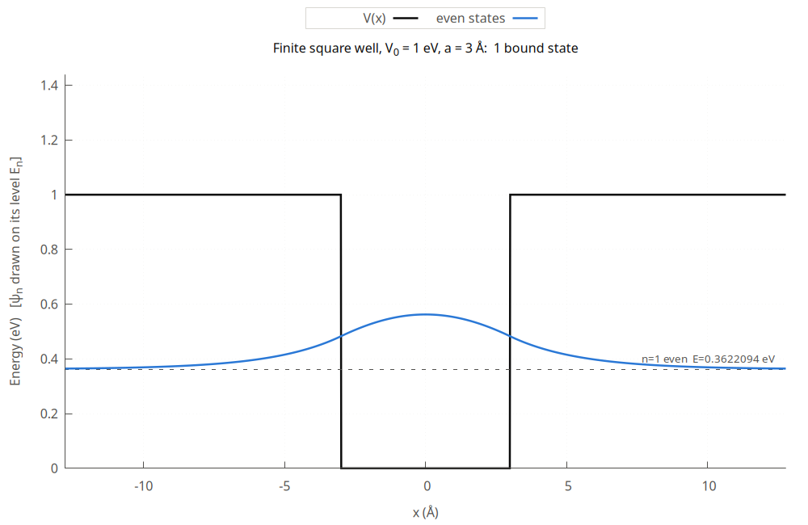 | 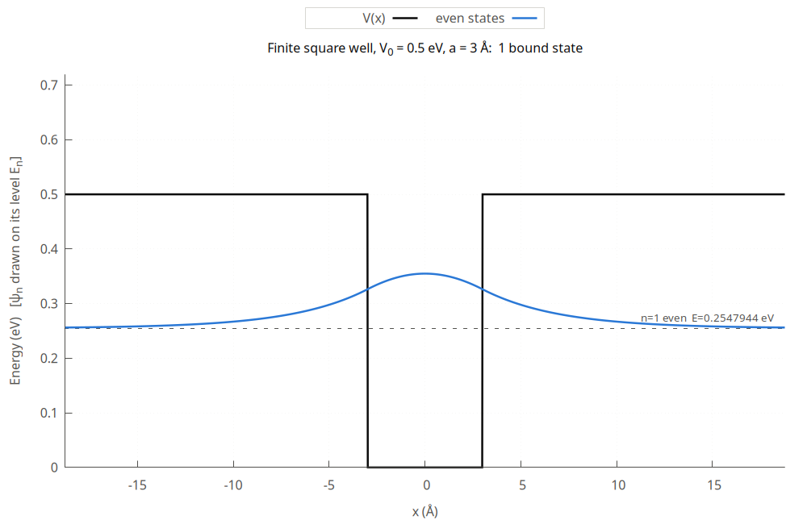 |

**Fig. 4 — Every bound-state energy as the depth is varied continuously from 0.1 to 20 eV.** A new state is born at the top of the well, $E = V_0$, each time $z_0$ passes a multiple of $\pi/2$, and the parity of the newborn state alternates. Lowering $V_0$ removes the states with the most nodes first, and the even ground state never disappears.

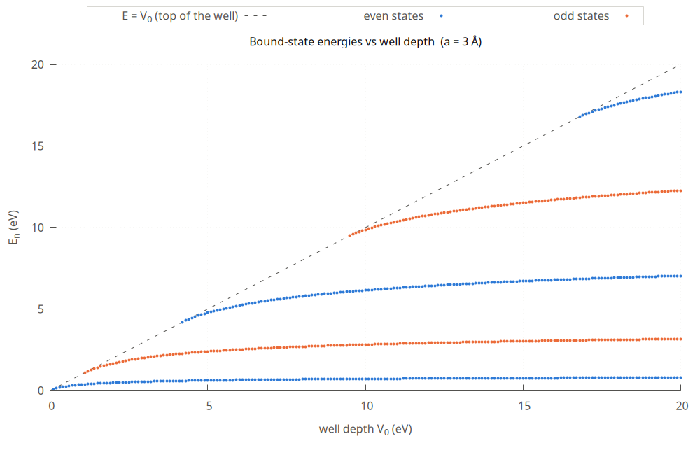

### 5.4 Effect of the well half-width $a$ (with $V_0 = 10$ eV)

| $a$ (Å) | $z_0$ | States | Energies (eV) |
|---|---|---|---|
| 3   | 4.860 | 4 | 0.71545 e, 2.82139 o, 6.14864 e, 9.86720 o |
| 2   | 3.240 | 3 | 1.35689 e, 5.19897 o, 9.92541 e |
| 1   | 1.620 | 2 | 3.41473 e, 9.97749 o |
| 0.5 | 0.810 | 1 | 6.37070 e |

> The original thesis reported a single state for $a = 1$ Å. The scan finds **two**, as $N = \lfloor 2(1.620)/\pi\rfloor + 1 = 2$ predicts: $z_0 = 1.620$ is just above $\pi/2 = 1.571$. The odd state at 9.977 eV is only 0.023 eV below the rim and spreads well outside the well ($P_{\text{out}} = 0.93$). That is why it is easy to miss on a graph.

| $a = 2$ Å | $a = 1$ Å | $a = 0.5$ Å |
|---|---|---|
| 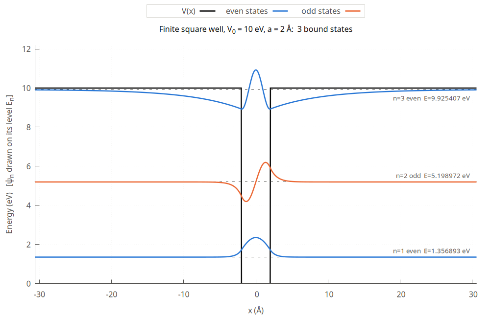 | 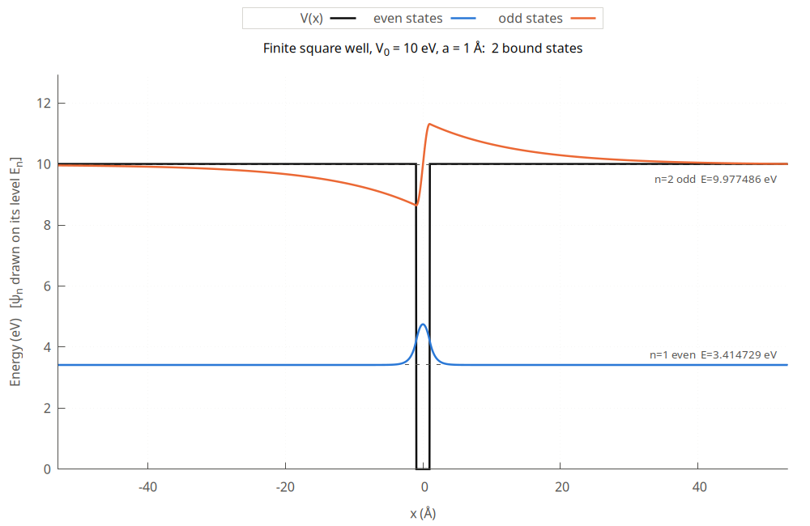 | 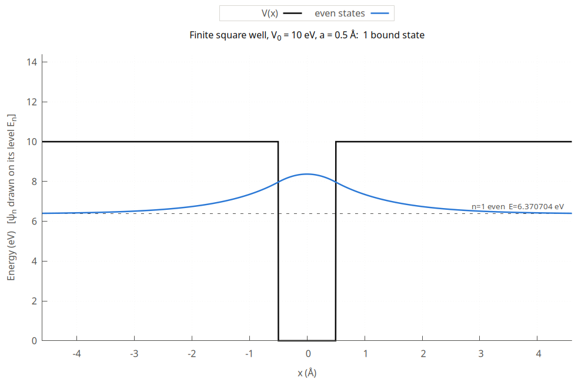 |

**Fig. 5 — Every bound-state energy as the half-width is varied from 0.05 to 6 Å.** Wider wells hold more states, and every level falls roughly as $1/a^2$, like the infinite well.

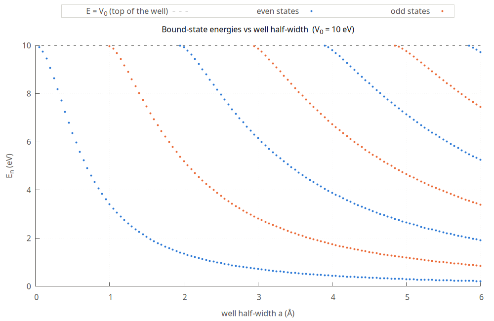

---

## 6. Extreme cases

A numerical method should be trusted only if it reproduces the known limits. The finite well has two: the **infinite square well** ($z_0 \to \infty$) and the **delta-function well** ($z_0 \to 0$).

### 6.1 Very deep well → infinite square well

For a well of width $2a$ with infinitely high walls, $E_n^{(\infty)} = \dfrac{n^2\pi^2\hbar^2}{2m(2a)^2}$. The finite well is solved with $a = 3$ Å and $V_0$ up to $10^4$ eV (98 bound states):

| $V_0$ (eV) | States | $E_1$ (eV) | $E_1/E_1^{(\infty)}$ | $E_4/E_4^{(\infty)}$ |
|---|---|---|---|---|
| 10     | 4  | 0.71545 | 0.685 | 0.590 |
| 100    | 10 | 0.92064 | 0.881 | 0.879 |
| 1 000  | 31 | 1.00283 | 0.960 | 0.960 |
| 10 000 | 98 | 1.03107 | 0.987 | 0.987 |
| $\infty$ | $\infty$ | 1.04453 | 1 | 1 |

**Fig. 6 — Ratio of finite-well to infinite-well energies.** Every curve approaches 1 as the well deepens. The remaining gap is just the leakage into the walls. A deep well behaves like an infinite well that is slightly wider, $2(a + 1/\beta)$, and indeed $(a/(a + 1/\beta))^2 = 0.987$ at $V_0 = 10^4$ eV, matching the computed ratio.

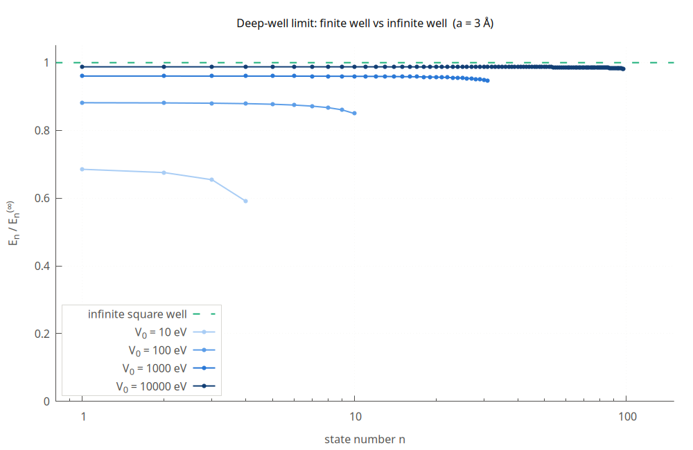

**Fig. 7 — A deep well, $V_0 = 50$ eV (7 states).** The wavefunctions look almost like $\sin$ and $\cos$ standing waves that vanish at the walls. Only the highest states leak noticeably.

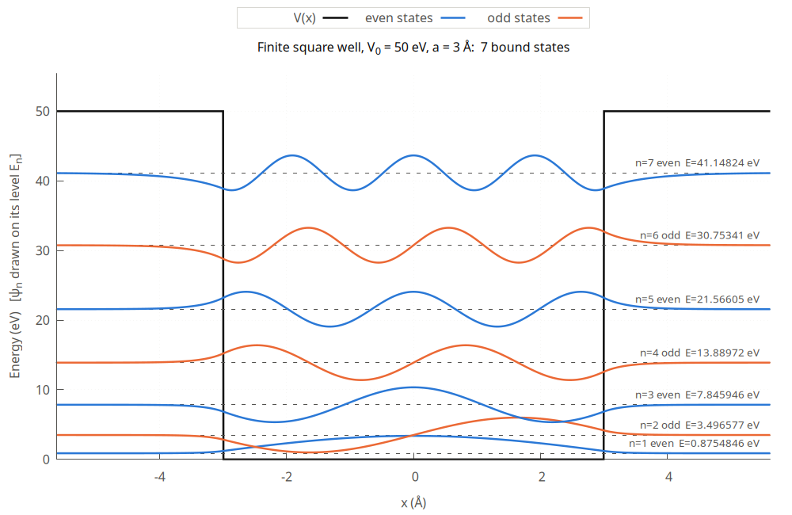

### 6.2 Very shallow or very narrow well → delta-function well

As $z_0 \to 0$, the well acts like $-g\,\delta(x)$ with strength $g = 2aV_0$, measured from the top. The delta well has exactly one bound state, with

$$
E_\delta = \frac{mg^2}{2\hbar^2}\ \text{(binding energy)}, \qquad \psi_\delta(x) = \sqrt{\kappa}\,e^{-\kappa|x|}, \quad \kappa = \frac{mg}{\hbar^2}.
$$

The finite-well binding energy is $E_B = V_0 - E_1$. The well is made weak in two independent ways:

- **shallower:** $a = 3$ Å fixed, $V_0$ from 10 eV down to $4\times10^{-5}$ eV;
- **narrower:** $V_0 = 10$ eV fixed, $a$ from 3 Å down to 0.006 Å.

**Fig. 8 — $E_B/E_\delta$ against $z_0$.** Both routes approach 1, and they fall on **one curve**. That is the correct scaling: $E_B/E_\delta$ depends only on $z_0$, not on $V_0$ and $a$ separately.

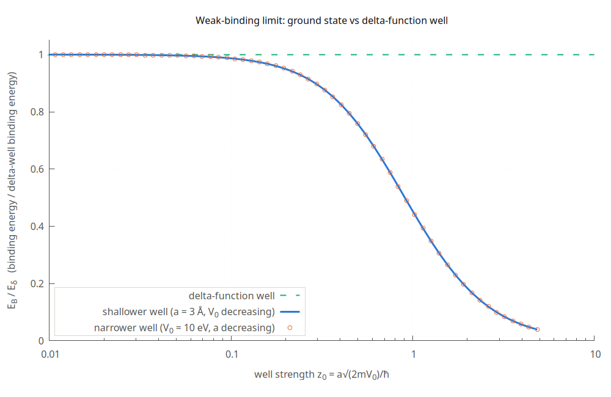

| $z_0$ | 4.86 | 1.72 | 0.61 | 0.22 | 0.077 | 0.027 | 0.0097 |
|---|---|---|---|---|---|---|---|
| $E_B/E_\delta$ | 0.039 | 0.229 | 0.679 | 0.941 | 0.9922 | 0.9990 | 0.99988 |

**Why the tip becomes pointed.** Inside the well the wavefunction is $\cos\alpha x$, which has a smooth, rounded top. Outside it is $e^{-\beta|x|}$, two exponential flanks. When the width $2a$ is comparable to the decay length $1/\beta$, the rounded middle is visible and $\psi$ looks like a **smooth cone**; this is the shape in thesis Figs. 11–12 ($a = 1$ and $0.5$ Å). As $a \to 0$ the rounded part shrinks to nothing and only the two exponentials remain, meeting in a **sharp tip**. That kink is required for a delta potential, which forces a jump in slope at the origin:

$$
\psi'(0^+) - \psi'(0^-) = -\frac{2mg}{\hbar^2}\,\psi(0).
$$

**Fig. 9 — Ground state of a narrowing well at fixed $V_0 = 10$ eV, in the style of the thesis figures.** Each curve is scaled to $\psi(0) = 1$. The inset zooms on the top: the $a = 1$ Å state (lightest) is rounded, while $a = 0.1$ Å (darkest) is pointed. Because $V_0$ is fixed, the strength $g = 2aV_0$ also falls as the well narrows, so the narrow states are more weakly bound and spread out further.

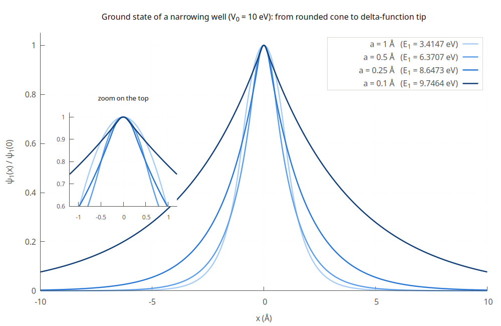

| $a$ (Å) | $E_1$ (eV) | $1/\beta$ (Å) | $2a \cdot \beta$ (rounded part / decay length) | Shape |
|---|---|---|---|---|
| 1    | 3.4147 | 0.76 | 2.6  | rounded cone |
| 0.5  | 6.3707 | 1.02 | 0.98 | rounded, sharper |
| 0.25 | 8.6473 | 1.68 | 0.30 | nearly pointed |
| 0.1  | 9.7464 | 3.88 | 0.05 | pointed tip |

**Fig. 10 — The true delta limit: $a \to 0$ with $g = 2aV_0 = 10$ eV·Å held fixed.** The ground state turns into the cusp $\sqrt{\kappa}\,e^{-\kappa|x|}$ (dashed):

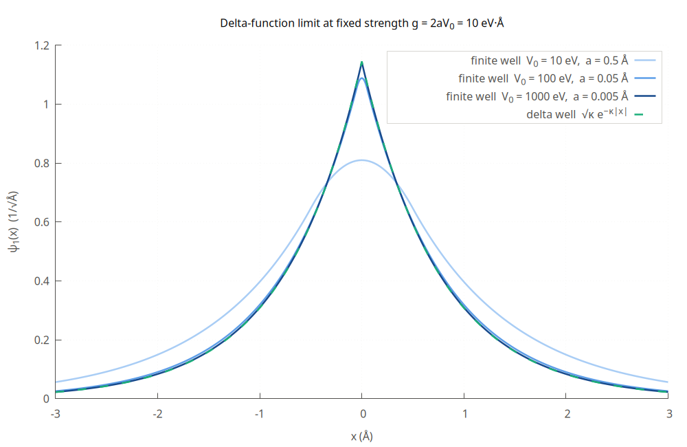

| $V_0$ (eV) | $a$ (Å) | $E_B$ (eV) | $E_B/E_\delta$ ($E_\delta = 6.5617$ eV) | $P_{\text{out}}$ |
|---|---|---|---|---|
| 10   | 0.5   | 3.6293 | 0.553 | 0.43 |
| 100  | 0.05  | 6.0397 | 0.920 | 0.88 |
| 1000 | 0.005 | 6.5049 | 0.991 | 0.99 |

**Fig. 11 — The extreme wavefunctions.** Even for a well only 0.01 eV deep, or only 0.2 Å wide, the even ground state survives, exactly as theory demands. It lives almost entirely *outside* the well ($P_{\text{out}} = 0.95$ in both cases), spread over hundreds of ångströms for the shallow well.

| Very shallow: $V_0 = 0.01$ eV, $a = 3$ Å | Very narrow: $V_0 = 10$ eV, $a = 0.1$ Å |
|---|---|
| 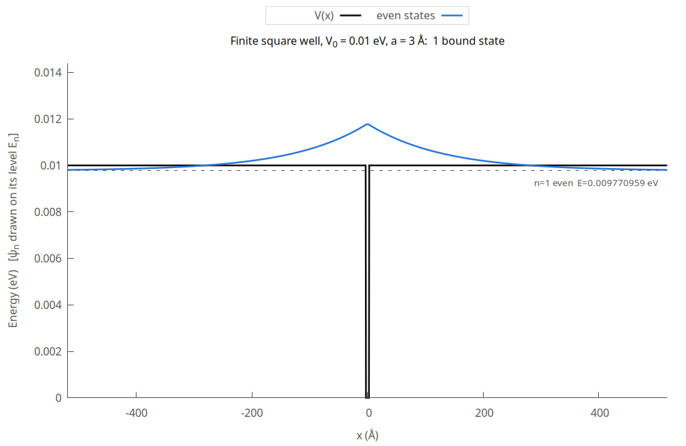 | 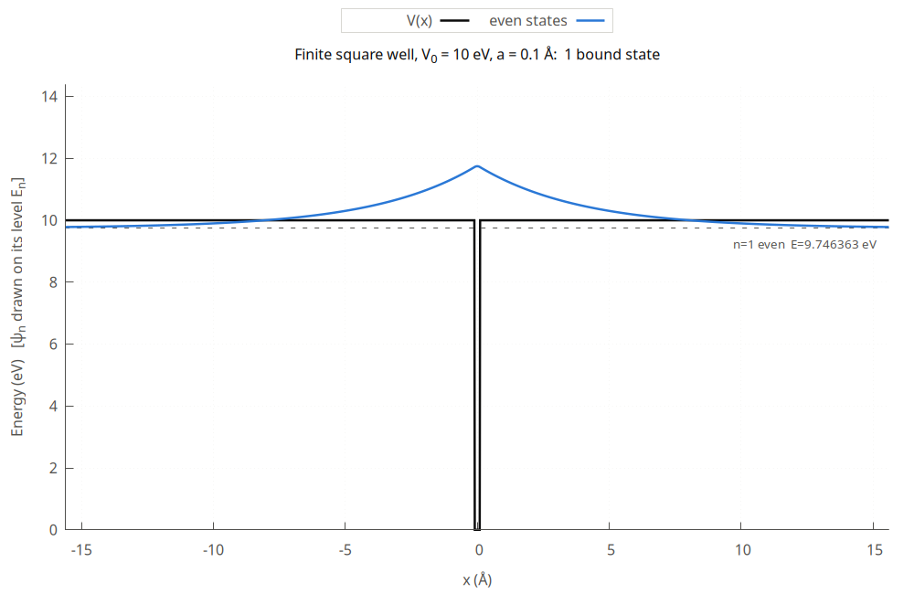 |

---

## 7. Conclusions

1. **Number of states.** A deeper or wider well holds more bound states: $N = \lfloor 2z_0/\pi\rfloor + 1$ with $z_0 = a\sqrt{2mV_0}/\hbar$. The code found exactly this many in all 322 wells studied. States are created and destroyed at the top of the well, highest node count first, with alternating parity.
2. **The ground state always survives.** However shallow or narrow the well, one even state remains, approaching the delta-function bound state (Figs. 8–11).
3. **Deep wells become infinite wells.** At $V_0 = 10^4$ eV, $a = 3$ Å, the energies are within 1.3 % of the infinite-well values. The remaining difference is the penetration depth $1/\beta$ (Fig. 6).
4. **Tunnelling.** Every state has a non-zero probability of being found outside the well. The probability grows towards the top of the well and reaches 95 % for very weak wells.
5. **The numerical method.** The hybrid of bisection and quadratic approximation is as safe as bisection and as fast as quadratic approximation. It reached $10^{-12}$ accuracy in 2–6 iterations, against 26–39 for bisection. Combined with an automatic sign-change scan, it gives every bound state of any well without reading a graph.

**Recommendations.** The same two modules can be reused for asymmetric wells, double wells (the tunnelling splitting), or any potential whose matching conditions reduce to $f(E) = 0$.

---

## 8. Corrections to the original thesis and code

These were found while revising. The original programs are kept unchanged in `original_thesis_code/` for reference.

### Code (`original_thesis_code/evenstates.f90`, `oddstate.f90`)

| Problem | Effect | Fix |
|---|---|---|
| Loop condition `do while (delta .gt. tol)` has no `abs()`. If the first quadratic step is negative, the loop stops after one iteration. | For the bracket [6.0, 6.4] the code stopped after 1 iteration and printed the unconverged value 6.148599054 for $E_3$. | `roots.f90` tests `abs(delta)`. Correct $E_3 = 6.148644136$ eV. |
| `hbar_sq = 7.6199682` is a single-precision literal. It is stored as 7.61996841…, not 7.6199682. | All energies off by ~$10^{-7}$ (7th digit). | Written as `7.6199682d0`. |
| `root_tester` bracketing: `(x2-xl)*(D - 2c)` instead of `(x2-xl)*D - 2c`. | The safety test of the hybrid was wrong. | Corrected (§4.3). |
| The bisection branch (`else`) could never run, because `b .ge. 0` / `b .le. 0` covers every case. When the test failed, `x3` was not updated. | The code was really pure quadratic approximation, with no fallback. | The safety test now chooses between the quadratic and bisection steps at every iteration. |
| No check that $b^2 - 4ac \ge 0$. | `sqrt` of a negative number gives NaN. | Checked; falls back to bisection. |

The test programs in `root_finding_tests/` received small, matching fixes. `bisection.f90` now stops if the interval does not bracket a root. In `quadratic_approximation.f90`, `tol` was 3.0 and the loop exited after one pass. In `hybrid.f90`, the bracket $[-0.1, -2.8]$ contained both roots (no sign change), `error` was used before being set, and `root_tester` had the bracketing error above. The test equations themselves are unchanged.

### Thesis text

| Location | Printed | Should be |
|---|---|---|
| Eq. (1.06) | $-\frac{\hbar}{2m}\frac{d^2\psi}{dx^2}$ | $-\frac{\hbar^2}{2m}\frac{d^2\psi}{dx^2}$ |
| Eq. (1.14) | $\beta = \sqrt{2m(V_0 - E)/\hbar}$ | $\beta = \sqrt{2m(V_0 - E)}/\hbar$ |
| Eq. (1.17) | $A\sin\alpha a + B\cos\alpha a$ | $A\sin\alpha x + B\cos\alpha x$ |
| Section "The infinite square well potential", first sentence | "The **finite** square well has … infinity outside" | "The **infinite** square well …" |
| Eqs. (1.26)–(1.28) | amplitude called $B$ then $A$; signs at $x = -a$ | one amplitude; $Ce^{-\beta a} = -B\sin\alpha a$ and $\beta Ce^{-\beta a} = \alpha B\cos\alpha a$ (the result $-\beta = \alpha\cot\alpha a$ is unchanged) |
| Eqs. (2.08), (2.10) | difference of the two brackets | **product**, $[(x_2 - x_L)D - 2c][(x_2 - x_R)D - 2c] \le 0$ (§4.3) |
| §3 units | $\hbar^2 = 7.6199682\ m_e\,\text{eV Å}$ | $\hbar^2/m_e = 7.6199682$ eV·Å² |
| Section "Variations of the well width" | $a = 1$ Å has a single state | it has **two** (§5.4) |

---

## 9. References

1. D. H. McIntyre, *Quantum Mechanics: A Paradigms Approach*. Oregon State University Press, 2018.
2. D. J. Griffiths and D. F. Schroeter, *Introduction to Quantum Mechanics*, 3rd ed. Cambridge University Press, 2018.
3. P. L. DeVries, *A First Course in Computational Physics*. New York: Wiley, 2006.
4. C. E. Siewert, "Explicit results for the quantum-mechanical energy states basic to a finite square-well potential," *J. Math. Phys.* **19**(2), 434–435, 1978.
